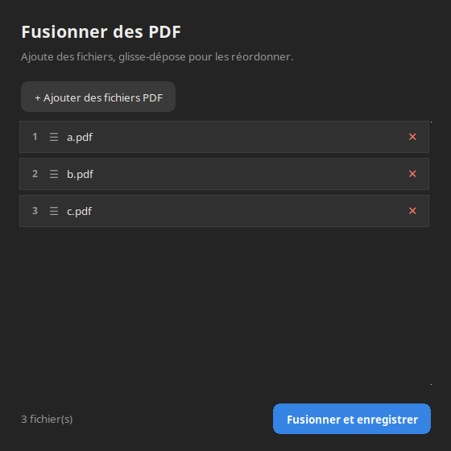

# PDF Merger

Petit outil pour fusionner plusieurs fichiers PDF en un seul, en ligne de
commande ou via une interface graphique (suit le thème clair/sombre du
système).



## Fonctionnalités

- **Mode CLI** : fusion directe en passant les fichiers en arguments.
- **Mode graphique** (lancé sans argument) :
  - ajout de fichiers PDF via le sélecteur natif (zenity),
  - réorganisation de l'ordre par glisser-déposer,
  - suppression d'un fichier via la croix sur sa ligne,
  - thème clair/sombre automatique (suit les préférences GNOME).

## Dépendances

Voir [DEPENDENCIES.md](DEPENDENCIES.md). En résumé, sur Debian/Ubuntu :

```bash
sudo apt install python3 python3-tk zenity poppler-utils
```

## Installation

Rendre la commande `pdf_merger` disponible globalement :

```bash
mkdir -p ~/.local/bin
cat > ~/.local/bin/pdf_merger <<'EOF'
#!/usr/bin/env bash
exec python3 /chemin/vers/pdf_merger.py "$@"
EOF
chmod +x ~/.local/bin/pdf_merger
```

Assure-toi que `~/.local/bin` est dans ton `PATH` (c'est déjà le cas par
défaut sur la plupart des distributions Ubuntu/Debian via `~/.profile`).

## Utilisation

```bash
# Mode ligne de commande : fusionne dans l'ordre donné, dernier argument = sortie
pdf_merger fichier1.pdf fichier2.pdf [...] sortie.pdf

# Mode graphique
pdf_merger

# Aide
pdf_merger --help
```
